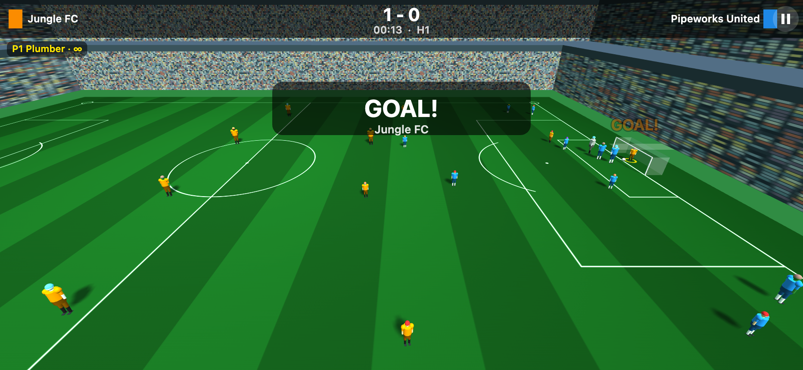
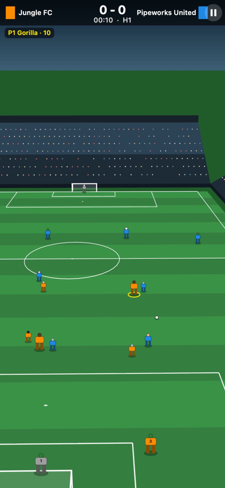
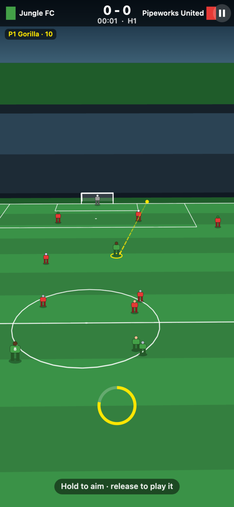
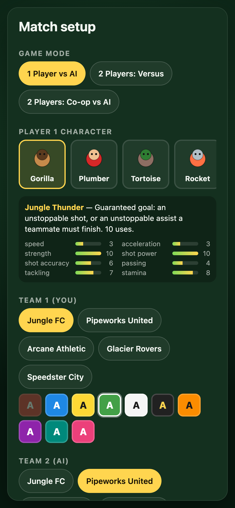

# Gorilla Football

A mobile-first 11-a-side arcade football game for one or two players on a
single phone or tablet, played from a 3D stadium camera. Plain HTML5 canvas
and ES modules: no build step, no dependencies, no network calls, and no 3D
library. The perspective is a hand-rolled projection, so the whole thing is
still a few files you can read.

You run the whole team, not one striker, with one finger: **tap to dribble, or
draw a line and the ball follows it**. Curve the line around a defender and the
ball curves with it. There is no separate pass and shoot button.



  

## Run it

Any static file server works. From the project root:

```bash
python3 -m http.server 8000 --bind 0.0.0.0
```

Then open <http://localhost:8000/> in a browser.

Node alternative (no install needed beyond npx):

```bash
npx --yes serve -l 8000 .
```

Or, if you have the repo's `package.json` handy:

```bash
npm start          # python3 http.server on :8000
npm run start:node # npx serve on :8000
npm test           # unit tests (node:test, no dependencies)
npm run sim        # headless AI-vs-AI match, prints score and event counts
```

### Playing on a phone on the same Wi-Fi

1. Start the server with `--bind 0.0.0.0` (as above) on your computer.
2. Find your computer's LAN address:
   - macOS: `ipconfig getifaddr en0`
   - Linux: `hostname -I | awk '{print $1}'`
   - Windows: `ipconfig` and read the IPv4 address
3. On the phone, open `http://<that-address>:8000/` — for example
   `http://192.168.1.42:8000/`.
4. Turn the phone sideways for the biggest pitch, or add the page to your home
   screen to play without browser chrome.

Both devices must be on the same network, and your firewall must allow inbound
connections on port 8000.

## Controls

Three control styles, chosen on the setup screen.

### Whole team, the default

A 3D stadium camera follows the ball. Every footballer on the pitch, yours
included, runs themselves; your job is the ball.

| Touch | What happens |
| --- | --- |
| **Tap**, with the ball | Dribble: knock it into space ahead and chase it. |
| **Tap**, without the ball | Close the carrier down. |
| **Draw a line** with your finger | The line appears on the grass. That is the route the ball will take. |
| **Release** | The ball sets off along the line you drew. |

You are not aiming in a straight line: you are **drawing the pass**. Curve the
line around a defender and the ball curves around the defender. The shape is
what matters, not where on the screen you drew it, because the line is anchored
to the ball. A longer line means a harder ball, and the ball is interceptible
the whole way, so a route through a crowd is a gamble.

There is no separate pass and shoot button. Draw a line that ends in the net and
that was a shot.

The player on the ball is ringed. Restarts work the same way: aim and release to
take the throw, corner, free kick or penalty. Leave your carrier alone for six
seconds and they will play it themselves, so a match never stalls.

Two players share the one screen: in portrait the bottom half is player one and
the top half player two; in landscape it splits left and right. Only the side in
possession can kick, so the two never fight over the ball.

### One player

You drive a single outfield player, marked with a ring, seen from straight
above. Nothing ever pauses. Each player gets a floating joystick and three
buttons on their own side of the screen. Touch anywhere in the joystick zone to
place the stick under your thumb.

| Button | With the ball | Without the ball |
| --- | --- | --- |
| **PASS** | Pass to the teammate you are aiming at | Tackle |
| **SHOOT** | Shoot (aim up or down to place it) | Slide tackle |
| **SPECIAL** | Your character's signature move | Your character's signature move |

At a restart the taker aims with the joystick and presses PASS or SHOOT. After
eight seconds they play it automatically so the game never stalls.

### One player, paced

Your footballer is driven by the same AI as everyone else, and the match
**freezes** at the moments where you have a genuine choice. A panel offers your options:

| Option | What it does |
| --- | --- |
| **SHOOT** | Have a go at goal. The panel shows the distance. |
| **PASS #n** | Play it to that teammate. The panel names them and says whether they are free or covered. |
| **SPECIAL** | Your character's signature move, with uses or cooldown remaining. |
| **DRIBBLE** | Carry on and decide again a moment later. |

While the panel is open the pitch shows where each pass would travel and where a
shot would be aimed, so you can read the choice without hunting for it.

The match freezes when you win the ball, when you carry it into shooting range,
when an opponent closes you down, after a few seconds of untroubled dribbling,
and at every restart you are taking. Nothing else pauses: defending, chasing and
positioning all happen at full speed. The joystick still steers between
decisions and the three buttons still work, so assisted control never takes your
player away from you.

### Keyboard

Desktop fallback for testing: player 1 uses `WASD` + `J` / `K` / `L`, player 2
uses the arrow keys + `1` / `2` / `3`, `Esc` pauses. `Esc` also works while a
decision panel is open.

## Modes

- **1 Player vs AI** — you control one outfield player, everyone else is AI.
- **2 Players: Versus** — two humans on opposite teams, one device.
- **2 Players: Co-op vs AI** — two humans on the same team against the AI.

Goalkeepers are always AI. In two-player modes the screen is split into two
control clusters (left/right in landscape, top/bottom in portrait) so two people
can hold the same device without reaching across each other.

## Characters

Seven original characters with deliberately large differences, not small
statistical nudges. Stats run 1–10 across speed, acceleration, strength, shot
power, shot accuracy, passing, tackling and stamina.

| Character | Identity | Special ability |
| --- | --- | --- |
| Gorilla | Very strong, cannon shot, slow | **Jungle Thunder** — guaranteed goal, 10 uses per match |
| Plumber | Fast, agile, balanced | **Turbo Hop** — 3 s of speed and tackle immunity |
| Tortoise | Immovable defender | **Shell Slam** — stuns opponents within 8 m |
| Rocket | Elite passer, physically weak | **Magnet Boots** — loose balls within 9 m come to your feet |
| Wizard | Deadly accurate, very frail | **Blink** — teleport 12 m forward with the ball |
| Yeti | Big, tough, tireless | **Cold Snap** — freezes opponents within 10 m |
| Penguin | Sprinter, poor stamina | **Belly Slide** — slide that always wins the ball, never a foul |

The Gorilla's special is implemented literally as specified: it is a guaranteed
scoring action. If the Gorilla can reach goal it fires an unstoppable homing
shot; otherwise it plays an unstoppable homing assist to the most advanced
teammate, who is then compelled to finish with an unstoppable shot. It is
capped at 10 uses per match and is intentionally overpowered.

Teams may repeat character types, and the five team presets do.

## Rules implemented

Goals, throw-ins, corners, goal kicks, offside (including the second-last
defender test, the ball-position test, own-half and restart exemptions), fouls,
free kicks with a defensive wall, penalties, yellow and red cards, second
yellow equals red, and playing a man down after a sending-off. Two halves with
teams switching ends at half time. No substitutions. Match length is
configurable before kickoff, default five minutes.

## Project layout

```
index.html              entry point
src/data/               content: characters, jerseys, formations, team presets
src/game/constants.js   pitch geometry, physics tuning, timing
src/game/vec.js         2D vector helpers
src/game/rng.js         seeded PRNG (deterministic simulation)
src/game/rules.js       pure football rules (no state mutation)
src/game/abilities.js   special-ability registry
src/game/entities.js    team/player/ball construction, stat derivation
src/game/config.js      match configuration and validation
src/game/match.js       the simulation: physics, possession, restarts, flow
src/game/ai.js          outfield AI
src/game/goalkeeper.js  goalkeeper AI
src/ui/camera.js        perspective camera: projection and unprojection
src/ui/renderer3d.js    3D stadium rendering (default)
src/ui/aiminput.js      hold-aim-release touch input
src/ui/hud.js           scoreboard, clock, cards, touch hint
src/ui/layout.js        screen layout and touch-control geometry
src/ui/renderer.js      top-down canvas rendering (the one-player styles)
src/ui/input.js         multi-touch, mouse and keyboard input
src/ui/screens.js       DOM screens (menu, setup, pause, half time, full time)
src/ui/app.js           application shell and game loop
test/                   node:test unit tests
scripts/simulate.js     headless match simulator
```

## Extending it

- **Characters:** add an entry to `src/data/characters.js`. Nothing in the
  simulation refers to a character by name, so licensed characters can replace
  these by editing that one file (or loading it from JSON).
- **Abilities:** call `registerAbility()` in `src/game/abilities.js` with an id,
  a cooldown, an optional `maxUses`, and `canActivate` / `activate` functions
  that act through the `Match` API. Point a character's `abilityId` at it.
- **Rules:** `src/game/rules.js` holds pure functions with no side effects, so
  rule variants can be swapped and unit-tested independently.
- **Art:** `src/ui/renderer3d.js` draws everything from each character's `look`
  block by projecting plain shapes. Swapping in models or sprites means changing
  only that file; `src/ui/camera.js` already hands it screen positions and a
  pixels-per-metre scale for any world point.
- **Formations:** add to `src/data/formations.js` using team-relative
  coordinates.

## Tests

```bash
npm test
```

Ninety-eight tests covering out-of-play classification, offside in both
directions, tackle and card resolution, penalties, match flow (halves, side
switching, kickoff after a goal), the Gorilla's ten guaranteed goals,
sending-off and control handover, config validation, simulation determinism,
and control layout at eight screen sizes.

Whole-team play and the 3D camera have their own suites: projection and
unprojection round-trip, handedness, the ball staying framed from every point on
the pitch, drag-to-power, aim direction matching the drag on screen, kicks being
refused when you do not have the ball, your carrier waiting for you but playing
on eventually, and a full match reaching full time.

Assisted control has its own suite: that the human's player moves with no input
while a manual one does not, that the clock, ball and all twenty-two players are
frozen while a decision is open, that each option does what it says, that a
disabled option cannot be taken, that dribbling reopens the panel, and that a
full assisted match reaches full time.

## Design decisions

These were judgement calls made while building, documented here rather than
asked about:

- **Browser over a game engine.** No build step, no install, and a phone can
  open it over the LAN instantly. The whole simulation is engine-agnostic
  plain JavaScript, so porting to an engine later means replacing only `src/ui`.
- **Fixed 60 Hz simulation step** decoupled from rendering, with a seeded PRNG,
  so matches are deterministic and rules logic is testable headlessly.
- **Utility/state-based AI**, as specified. Each frame a player is carrying,
  supporting, defending or chasing a loose ball, and picks a target accordingly.
- **One human controls one fixed player** rather than switching to whoever is
  nearest. Switching adds control ambiguity in two-player modes, and fixed
  control makes the character choice matter.
- **Whole-team aim control is the default.** You run the side and play the ball
  with one touch; everyone moves themselves. The two older styles, which give
  you a single player from a top-down view, are kept as setup options rather
  than deleted, because they work and they exercise the same simulation.
- **3D without a 3D library.** The perspective is a look-at basis and a divide
  by depth in `src/ui/camera.js`, painted back-to-front on the same 2D canvas.
  Pulling in Three.js would look better but would add a CDN dependency to a game
  whose whole point is that it opens instantly over your own Wi-Fi with nothing
  installed.
- **The camera runs on rails down the pitch.** It tracks the ball sideways only
  partially and its axis stays nearly parallel to the touchlines, so the pitch
  does not swing about as the ball moves. The parameters were picked by a search
  that required the ball to stay on screen from every point on the pitch at four
  screen sizes; `test/camera.test.js` checks that it still does.
- **You draw the pass, you do not aim it.** The whole stroke is captured,
  projected onto the grass and followed by the ball, so a curled ball round a
  defender is something you draw rather than something the game does for you.
  A straight-line aim is kept only as a fallback for when the stroke cannot be
  resolved onto the pitch, such as a finger dragged above the horizon.
- **The drawn ball stays interceptible.** It follows the line but anyone can cut
  it out, so drawing a route through traffic is a real risk rather than a
  guaranteed delivery.
- **A tap is a real touch, not a free ride.** Dribbling knocks the ball into
  space ahead and gives the carrier a short burst to chase it, so an opponent
  standing in the way can nick it. Tapping forward has to be a decision or it
  would just be a faster way to walk.
- **Decision moments are deliberately rationed** in assisted play. Pausing on
  every touch would be exhausting, so the panel opens on winning the ball,
  entering shooting range, being closed down (at most every 4.5 s) and after 5 s
  of untroubled carrying. That works out at roughly one decision every five
  seconds of play.
- **Teammates look for the human in assisted play.** A human receiver gets a
  bonus when the AI ranks its pass options, and the human chases loose balls a
  little harder. Without it the person holding the phone spent most of the match
  watching, which is the wrong game.
- **Restart takers wait for the human** who should take it, with an eight-second
  timeout so play never stalls.
- **Offside is judged at the moment of the kick** and punished on the next
  touch, mirroring the real rule without needing a separate assistant-referee
  system.
- **A sent-off human's control passes to the nearest teammate** so a red card
  does not end the match for that player.
- **Jerseys are validated for contrast** before kickoff; the setup screen
  refuses to start with two similar kits.
- **Co-op splits the screen differently from versus.** In versus the two
  control clusters sit at opposite ends so the players face each other across
  the device. In co-op both clusters sit at the bottom, stacked, so neither
  player is reading the pitch upside down.

## Known simplifications

Deliberate scope choices for a prototype, listed so they are not mistaken for
bugs:

- **Throw-ins are taken with a kick**, not a two-handed throw. The restart, the
  possession award and the offside exemption are correct; only the animation
  and the "must use hands" rule are missing.
- **Assisted play never pauses for defensive choices.** Tackling, marking and
  interceptions stay automatic, with the buttons available live. Pausing for
  them would interrupt constantly and the choices are far less interesting.
- **The AI does not use special abilities** by default. Several preset rosters
  contain Gorillas, and an AI with guaranteed goals is not fun to play against.
  Set `aiUsesSpecials: true` in the match config to switch it on.
- **No advantage rule, no injury time, no substitutions**, and a foul always
  stops play immediately.
- **The goal frame has no collision.** A shot that would hit a post travels
  through it rather than rebounding.
- **The stadium camera does not show the whole pitch at once.** It follows the
  ball, which is what a 3D football game does; the original top-down styles
  still show everything if you want that.
- **Players are drawn as simple stacked shapes**, not models. There are no
  assets of any kind in the repository.
- **A sending-off leaves the team a player short** but the AI does not reshape
  its formation to compensate.
